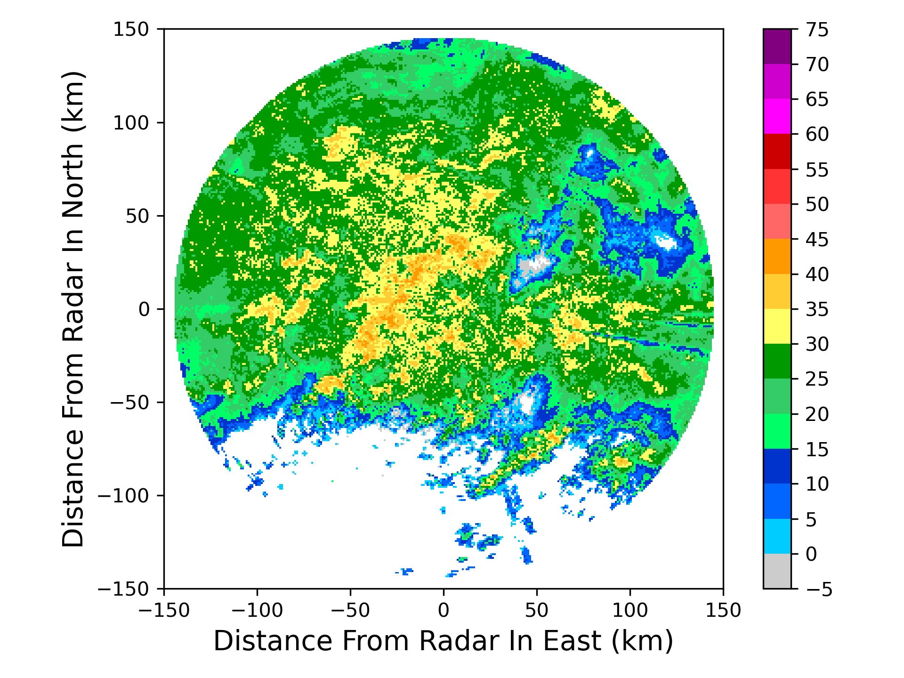
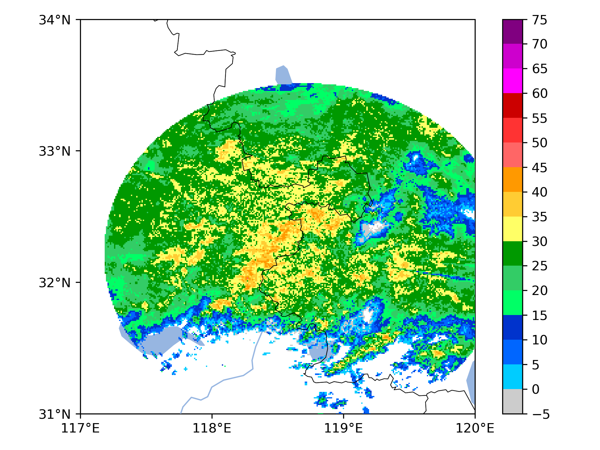

CAPPI产品
===============

以雷达为中心，生成笛卡尔坐标的CAPPI网格产品

.. code-block:: python
    :linenos:
    :emphasize-lines: 3,5

    from pycwr.io import read_auto
    import matplotlib.pyplot as plt
    from pycwr.draw.RadarPlot import plot_xy
    import numpy as np

    filename = r"./data/NUIST.20150627.002438.AR2.bz2"
    PRD = read_auto(filename)

    x1d = np.arange(-150000, 150001, 1000) ##x方向1km等间距， -150km～150km范围
    y1d = np.arange(-150000, 150001, 1000) ##y方向1km等间距， -150km～150km范围
    PRD.add_product_CAPPI_xy(XRange=x1d, YRange=y1d, level_height=3000) ##level height units:meters
    print(PRD.product)
    grid_x, grid_y = np.meshgrid(x1d, y1d, indexing="ij")
    fig, ax = plt.subplots()
    plot_xy(ax, grid_x, grid_y, PRD.product.CAPPI_3000) ##画图显示
    ax.set_xlabel("Distance From Radar In East (km)", fontsize=14)
    ax.set_ylabel("Distance From Radar In North (km)", fontsize=14)
    plt.tight_layout()
    plt.show()

利用经纬度坐标信息生成CAPPI网格产品

.. code-block:: python
    :linenos:
    :emphasize-lines: 3,5

    from pycwr.io import read_auto
    import matplotlib.pyplot as plt
    from pycwr.draw.RadarPlot import plot_lonlat_map
    import cartopy.crs as ccrs
    import numpy as np

    filename = r"./data/NUIST.20150627.002438.AR2.bz2"
    PRD = read_auto(filename)

    lon1d = np.arange(117, 120.001, 0.01) ##lon方向0.01等间距，117-120范围
    lat1d = np.arange(31, 34.001, 0.01) ##lat方向0.01等间距， 31-34度范围
    PRD.add_product_CAPPI_lonlat(XLon=lon1d, YLat=lat1d, level_height=3000) ##插值1500m高度的
    # XLon:np.ndarray, 1d, units:degrees
    # YLat:np.ndarray, 1d, units:degrees
    # level_height:常量，要计算的高度 units:meters
    grid_lon, grid_lat = np.meshgrid(lon1d, lat1d, indexing="ij")
    ax = plt.axes(projection=ccrs.PlateCarree())
    plot_lonlat_map(ax, grid_lon, grid_lat, PRD.product.CAPPI_geo_3000, transform=ccrs.PlateCarree())
    ax.set_extent([117, 120, 31, 34], crs = ccrs.PlateCarree()) #设置范围
    plt.tight_layout()
    plt.show()

