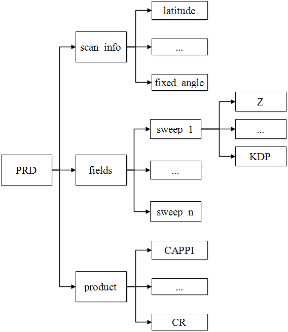

数据结构
==========

为了增加雷达数据的易用性，读取后的雷达数据会转换为偏振雷达数据（PRD, Polarimetric Radar Data）类，该类由两部分构成，
一部分是扫描信息（scan_info），它主要包含了雷达站点的经纬度、高度、扫描类型、雷达频率、不模糊速度等信息，
另一部分是观测数据（fields），它是一个列表容器，存储不同仰角的雷达扫描数据，列表的每个元素都是xarray的DataArray类，
DataArray类提供了一个围绕numpy的ndarray类的包装器，该包装器使用标注的维度和坐标来支持元数据操作，
极大的提高了数据的可读性和可理解性。

