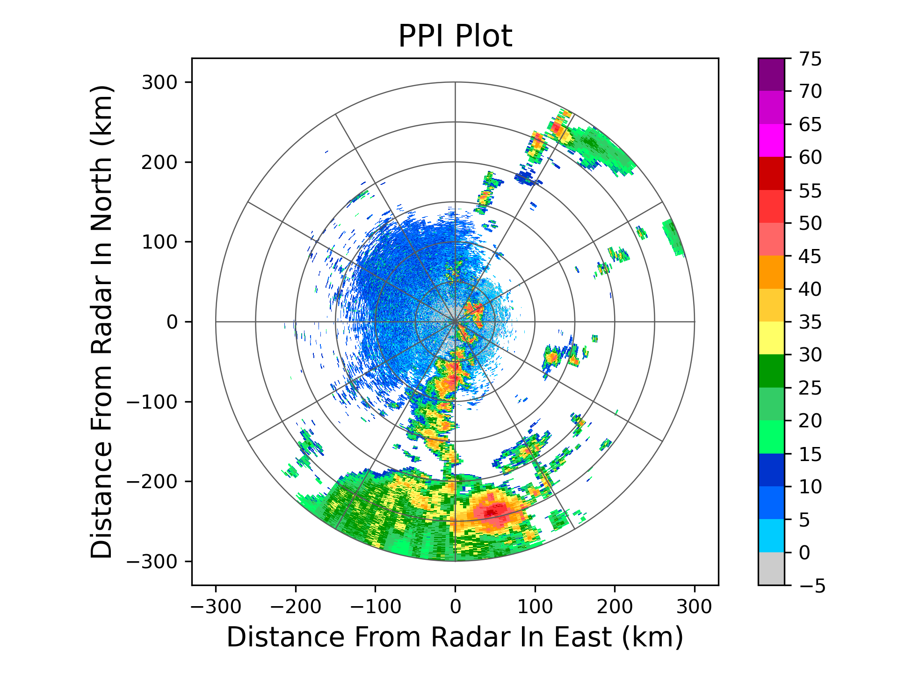

绘图
==========

PPI绘图不叠加地图：

.. code-block:: python
    :linenos:
    :emphasize-lines: 3,5

    from pycwr.io import read_auto
    import matplotlib.pyplot as plt
    from pycwr.draw.RadarPlot import Graph

    filename = r"./data/Z_RADR_I_Z9898_20190828181529_O_DOR_SAD_CAP_FMT.bin.bz2"
    PRD = read_auto(filename)
    fig, ax = plt.subplots()
    graph = Graph(PRD)
    graph.plot_ppi(ax, 0, "dBZ", cmap="CN_ref") ## 0代表第一层, dBZ代表反射率产品
    graph.add_rings(ax, [0, 50, 100, 150, 200, 250, 300])
    ax.set_title("PPI Plot", fontsize=16)
    ax.set_xlabel("Distance From Radar In East (km)", fontsize=14)
    ax.set_ylabel("Distance From Radar In North (km)", fontsize=14)
    plt.show()

