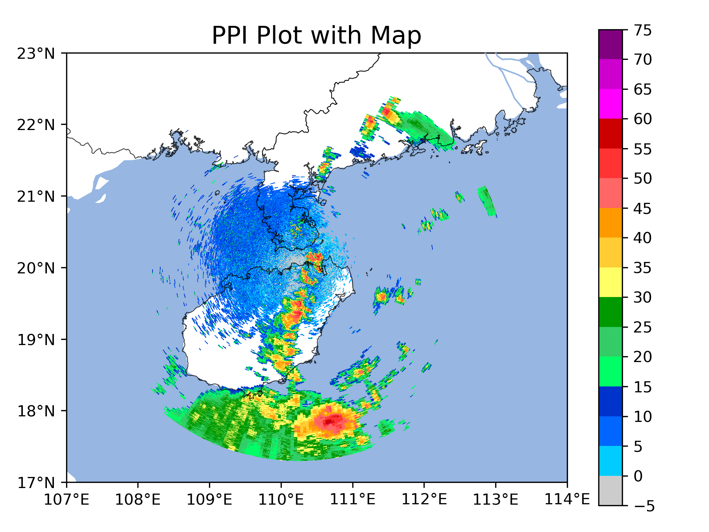
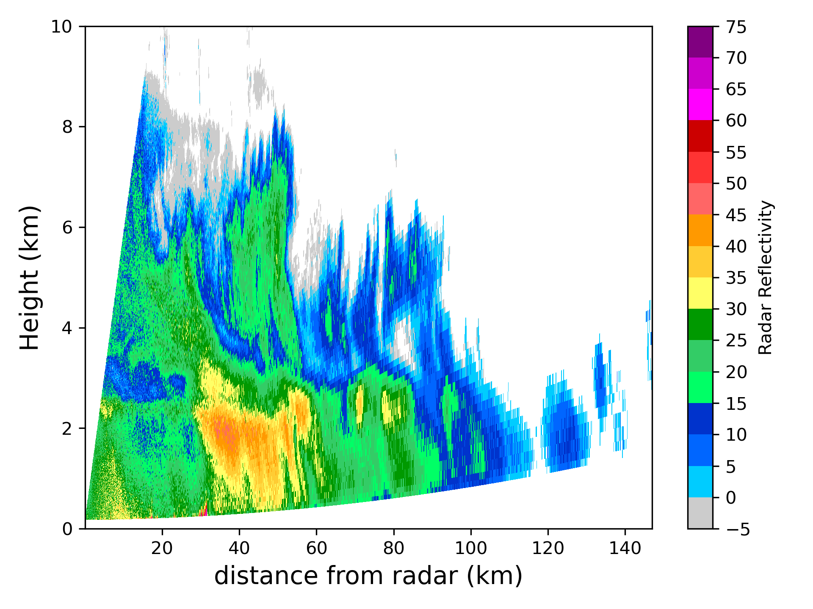
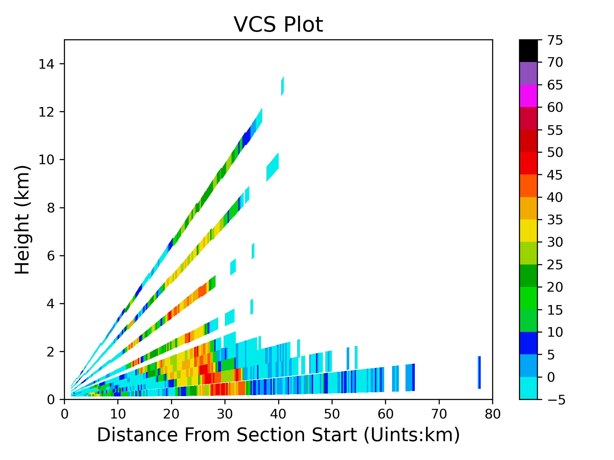

绘图
==========

PPI绘图不叠加地图：

.. code-block:: python
    :linenos:
    :emphasize-lines: 3,5

    from pycwr.io import read_auto
    import matplotlib.pyplot as plt
    from pycwr.draw.RadarPlot import Graph

    filename = r"./data/Z_RADR_I_Z9898_20190828181529_O_DOR_SAD_CAP_FMT.bin.bz2"
    PRD = read_auto(filename)
    fig, ax = plt.subplots()
    graph = Graph(PRD)
    graph.plot_ppi(ax, 0, "dBZ", cmap="CN_ref") ## 0代表第一层, dBZ代表反射率产品
    graph.add_rings(ax, [0, 50, 100, 150, 200, 250, 300])
    ax.set_title("PPI Plot", fontsize=16)
    ax.set_xlabel("Distance From Radar In East (km)", fontsize=14)
    ax.set_ylabel("Distance From Radar In North (km)", fontsize=14)
    plt.show()

.. image:: _static/draw_01.png
    :height: 400px
    :align: center
    :alt: reStructuredText, the markup syntax

PPI绘图叠加地图：

.. code-block:: python
    :linenos:
    :emphasize-lines: 3,5

    from pycwr.io import read_auto
    import matplotlib.pyplot as plt
    from pycwr.draw.RadarPlot import GraphMap
    import cartopy.crs as ccrs
    filename = r"./data/Z_RADR_I_Z9898_20190828181529_O_DOR_SAD_CAP_FMT.bin.bz2"
    PRD = read_auto(filename)

    ax = plt.axes(projection=ccrs.PlateCarree())
    graph = GraphMap(PRD, ccrs.PlateCarree())
    graph.plot_ppi_map(ax, 0, "dBZ", cmap="CN_ref") ## 0代表第一层, dBZ代表反射率产品，cmap
    ax.set_title("PPI Plot with Map", fontsize=16)
    plt.tight_layout()
    plt.show()

雷达RHI绘图:

.. code-block:: python
    :linenos:
    :emphasize-lines: 3,5

    from pycwr.io import read_auto
    import matplotlib.pyplot as plt
    from pycwr.draw.RadarPlot import Graph

    filename = r"./data/NUIST.20170323.142921.AR2"
    PRD = read_auto(filename)

    fig, ax = plt.subplots()
    graph = Graph(PRD)
    graph.plot_rhi(ax, 0, field_name="dBZ", cmap="CN_ref", clabel="Radar Reflectivity")
    ax.set_ylim([0, 10]) #设置rhi的高度范围 （units：km）
    ax.set_xlabel("distance from radar (km)", fontsize=14)
    ax.set_ylabel("Height (km)", fontsize=14)
    plt.tight_layout()
    plt.show()

天气雷达剖面图：

.. code-block:: python
    :linenos:
    :emphasize-lines: 3,5

    from pycwr.io import read_auto
    import matplotlib.pyplot as plt
    from pycwr.draw.RadarPlot import Graph

    filename = r"./data/Z_RADR_I_Z9898_20190828181529_O_DOR_SAD_CAP_FMT.bin.bz2"
    PRD = read_auto(filename)

    fig, ax = plt.subplots()
    graph = Graph(PRD)
    graph.plot_vcs(ax, (0,0), (150, 0), "dBZ", cmap="pyart_NWSRef") #起点，终点 （units: km）
    ax.set_ylim([0, 15])
    ax.set_xlim([0, 80])
    ax.set_ylabel("Height (km)", fontsize=14)
    ax.set_xlabel("Distance From Section Start (Uints:km)", fontsize=14)
    ax.set_title("VCS Plot", fontsize=16)
    plt.tight_layout()
    plt.show()

