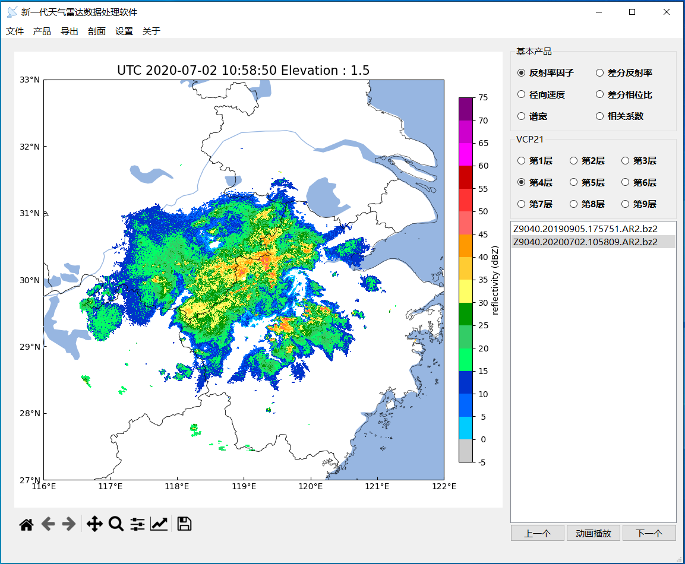

图形化界面显示
=================

用Python执行此脚本可以启动图形化界面程序：

.. code-block:: python   
    :linenos:   
    :emphasize-lines: 3,5
    
    import warnings
    warnings.filterwarnings('ignore')
    import os, sys
    sys.path.append(os.path.dirname(os.path.dirname(os.path.abspath(__file__))))
    from pycwr.GraphicalInterface.RadarInterface import MainWindow
    from PyQt5 import QtWidgets
    app = QtWidgets.QApplication(sys.argv)
    ui = MainWindow()
    ui.show()
    sys.exit(app.exec_())

图形化界面打开后如下图：

在右侧可以选择要显示的 **产品** 和 **仰角** ，在 **设置->显示设置->叠加地图** 可以选择显示的图像是否叠加地图。

