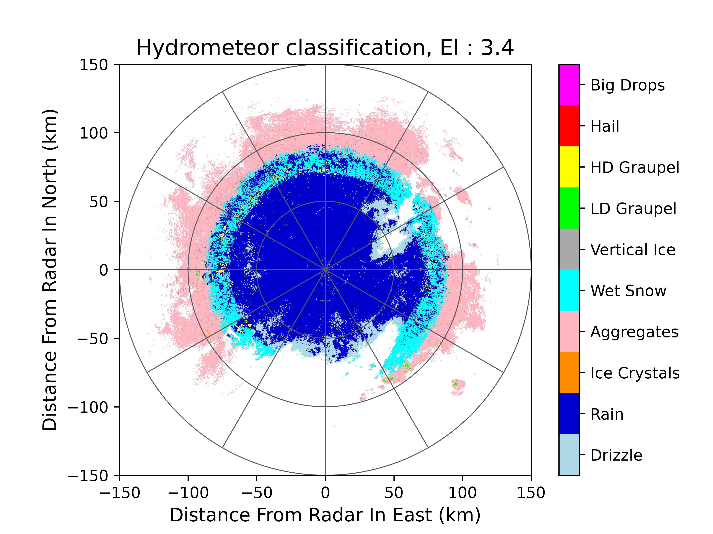

水凝物分类
===============

水凝物分类示例程序：

.. code-block:: python
    :linenos:
    :emphasize-lines: 3,5

    # -*- coding: utf-8 -*-
    from pycwr.io import read_auto
    from pycwr.retrieve.HID import fhc_HCL
    import matplotlib.pyplot as plt
    import numpy as np
    from pycwr.draw.RadarPlot import plot_xy, add_rings
    import pandas as pd

    file = r"./data/NUIST.20150627.002438.AR2.bz2"
    file_t = r"./data/20150627.csv"
    temp = pd.read_csv(file_t, index_col=0, header=None, names=['temp'])

    NRadar = read_auto(file)
    num = 3
    dBZ = np.where(NRadar.fields[num].CC>0.9, NRadar.fields[num].dBZ, np.nan)
    KDP = np.where(NRadar.fields[num].CC>0.9, NRadar.fields[num].KDP, np.nan)
    ZDR = np.where(NRadar.fields[num].CC>0.9, NRadar.fields[num].ZDR, np.nan)
    CC = np.where(NRadar.fields[num].CC>0.9, NRadar.fields[num].CC, np.nan)
    temp_2d = np.interp(NRadar.fields[num].z.values/1000., temp.index, temp['temp'])
    dBZ[:,0] = np.nan
    ticks = np.arange(1, 11, 1)
    ticklabels = ['Drizzle', 'Rain', 'Ice Crystals', 'Aggregates', 'Wet Snow', 'Vertical Ice',
                    'LD Graupel', 'HD Graupel', 'Hail', 'Big Drops']

    hcl = fhc_HCL(dBZ=dBZ, KDP=KDP, ZDR=ZDR, CC = CC, T=temp_2d)
    fig, ax = plt.subplots()
    plot_xy(ax, NRadar.fields[num].x, NRadar.fields[num].y, hcl,
            cmap="CN_hcl", bounds=np.arange(0.5,10.6,1),
            cbar_ticks=ticks, cbar_ticklabels=ticklabels)
    add_rings(ax=ax, rings=[0, 50, 100, 150])
    ax.set_xlim([-150, 150])
    ax.set_ylim([-150, 150])
    ax.set_xlabel("Distance From Radar In East (km)", fontsize=12)
    ax.set_ylabel("Distance From Radar In North (km)", fontsize=12)
    ax.set_title("Hydrometeor classification, El : 3.4", fontsize=14)
    plt.savefig(r"./201506270024_HC.png", dpi=600)
    plt.show()

水凝物分类效果：

